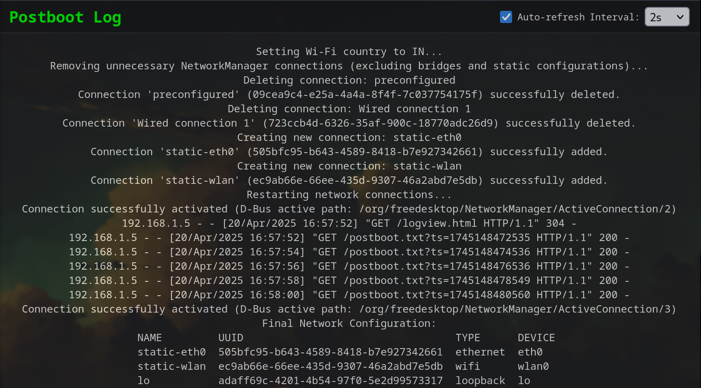

# PiForge

This repository provides an easy-to-use script to **download, flash, and provision a flash drive** with the latest **Raspberry Pi OS** for setting up a Raspberry Pi 5, specifically for **home automation services**.

---

## Features

- Selects **image architecture** (ARM64 or ARM32)
- Selects **image type** (Lite, Desktop, or Full)
- **Downloads** and **decompresses** the latest image
- **Automatically detects** supported block devices
- **Flashes** the OS image to the selected device
- **Provisions** the Pi with:
  - Hostname
  - SSH public key
  - User password
  - WiFi credentials (SSID, password, IP, DNS, gateway)
  - Ethernet configuration
  - Country and timezone

---

## Requirements

- A **Raspberry Pi 5** device.
- A **flash drive** or **microSD card**.
- A **Linux-based machine** (e.g., Ubuntu, Arch Linux).
- The following utilities:
  - `wget`
  - `xz`
  - `lsblk`
  - `dd`

---

## Installation

1. Clone the repository:

```bash
git clone https://github.com/pankajackson/PiForge.git
cd PiForge
pip install -r requirements.txt
```

---

## Usage

### Step 1: Run the Script

```bash
sudo python flasher.py
```

_Or with virtualenv:_

```bash
sudo env "PATH=$PATH" "$(which python)" flasher.py
```

---

### Step 2: Follow the Prompts

The script will guide you through the following prompts:

```text
1. ARM64
2. ARM32
Please select an image architecture:

1. DESKTOP
2. LITE
3. FULL
Please select an image type:


Enter hostname [pi.linuxastra.in]:
Using SSH key: id_rsa.pub
Enter password for user jackson:
Enter SSID for WIFI [JACKSON_WIFI]:
Enter WPA password for JACKSON_WIFI:
Enter IP addresses for wlan0 [192.168.1.3/24]:
Enter DNS servers for wlan0 [8.8.8.8]:
Enter IP addresses for eth0 [192.168.1.2/24]:
Enter DNS servers for eth0 [8.8.8.8]:
Enter gateway [192.168.1.1]:
Enter country code for WIFI [IN]:
Enter timezone [Asia/Kolkata]:


Available devices:
1. /dev/sda
2. /dev/sdb
Select a device:

```

The script will:

- Unmount any mounted partitions on the selected device
- Flash and provision the image
- Mount and configure the `boot` and `root` partitions
- Configure provisioning scripts
- Safely unmount all partitions when done

Sample output:

```text
✅ First boot actions complete!
✅ Post boot Provisioning complete!
✅ Raspberry Pi is ready. Insert the SD card and boot up!
```

> **⚠️ WARNING:** All data on the selected device will be erased.

---

### Step 3: Monitor Flash Progress (Optional)

```bash
watch iostat -h -p sda -d
```

> Replace `sda` with your selected device name.

### Step 4: Boot Raspberry Pi and check post-boot actions logs

Open browser and navigate to `http://<your-pi-ip-address>:8182/logview.html`.

[](docs/images/postboot_log.png)

## Supported Devices

The script detects and lists only **removable storage devices**, including:

- `/dev/mmcblkX` (microSD)
- `/dev/sdX` (USB flash)
- `/dev/nvmeXnY` (NVMe)

Make sure not to select your system disk!

---

## Troubleshooting

**Q: No supported devices found?**  
Ensure your flash drive is connected and not mounted. Use `lsblk` to check.

**Q: Script not working?**  
Verify these dependencies are installed:

```bash
sudo pacman -S wget xz coreutils util-linux  # Arch
sudo apt install wget xz-utils coreutils     # Debian/Ubuntu
```

---

## License

This project is licensed under the MIT License. See [LICENSE](LICENSE).

---

## Contributors

- **Pankaj Jackson** – _Author and Maintainer_
- Contributions welcome! Fork and PR any improvements.

---

## Contact

Found an issue or want to suggest a feature?  
Please open an issue in this repository.
